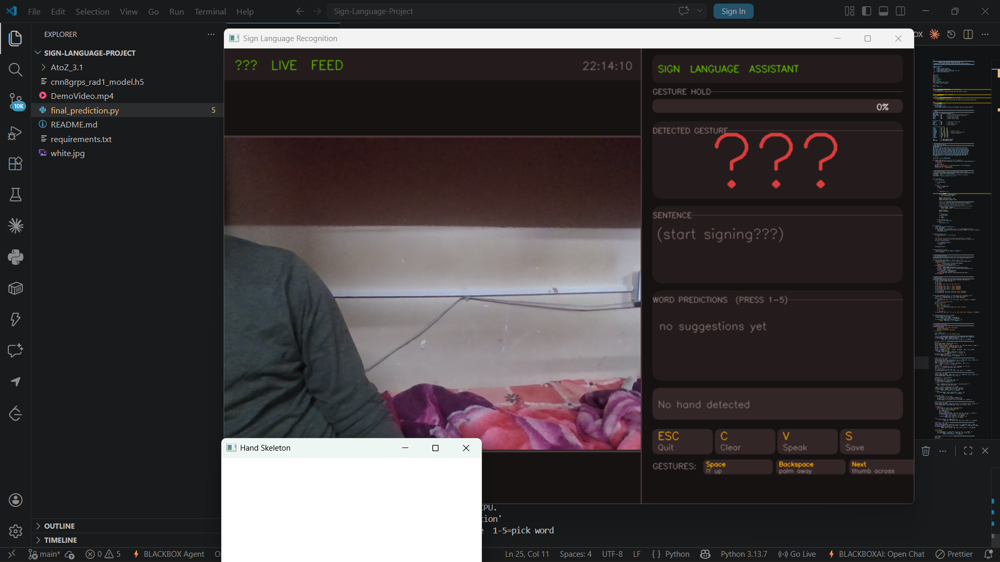
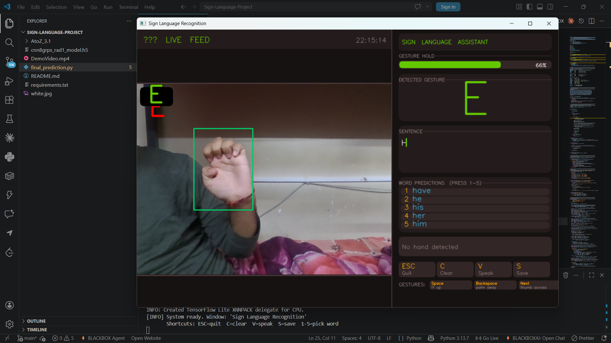
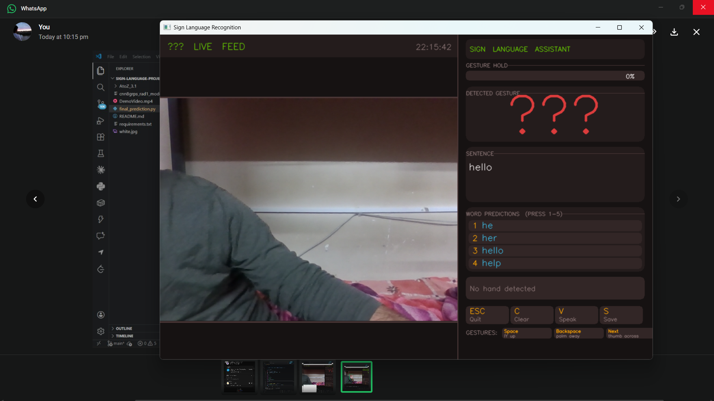

# ✋ Enhanced Sign Language Recognition System (ESLRS)

> Real-time gesture-to-speech communication using computer vision and deep learning.


---

## Table of Contents

1. [Overview](#1-overview)
2. [Key Features](#2-key-features)
3. [How It Works](#3-how-it-works)
4. [Dataset & Preprocessing](#4-dataset--preprocessing)
5. [Model Architecture](#5-model-architecture)
6. [Tech Stack](#6-tech-stack)
7. [Folder Structure](#7-folder-structure)
8. [How to Run](#8-how-to-run)
9. [Output](#9-output)
10. [Future Improvements](#10-future-improvements)
11. [Conclusion](#11-conclusion)

---

## 1. Overview

This project presents a **real-time Sign Language Recognition System** that converts hand gestures into text and speech using computer vision and deep learning techniques.

The system captures hand gestures via webcam, processes them into a structured representation, predicts the corresponding character, and converts the output into speech — enabling seamless communication for hearing-impaired individuals.

---

## 🎬 Demo Video

> [▶️ Watch Demo](https://youtu.be/PCtEu82GTNg)

---

## 2. Key Features

- 🎥 Real-time hand gesture recognition
- 🧠 CNN-based gesture classification
- 🖐️ 21-point hand landmark detection (MediaPipe)
- 🧾 Sentence formation from predicted characters
- 🔤 Word prediction for faster communication
- 🔊 Text-to-Speech (TTS) output
- 💾 Save conversation feature

---

## 3. How It Works

```
Webcam Input
↓
Hand Detection (MediaPipe)
↓
Landmark Extraction (21 points)
↓
Skeleton Representation (White Background)
↓
CNN Classification (Grouped Classes)
↓
Rule-Based Refinement
↓
Character Output
↓
Sentence Formation
↓
Text-to-Speech Output
```

---

## 4. Dataset & Preprocessing

### 📂 Dataset

- Contains hand gesture images for **A–Z alphabets**
- Organized into class-wise folders
- Preprocessed dataset is included in `AtoZ_3.1/`

---

### ⚙️ Preprocessing Pipeline

The system uses a **skeleton-based representation** for robust gesture recognition.

#### Step 1 — Hand Detection
- Detect hand using **MediaPipe**
- Extract 21 landmark points

#### Step 2 — Region Isolation
- Focus only on the hand region

#### Step 3 — Skeleton Generation
- Draw landmarks on a **plain white background**
- Removes background noise and lighting effects

#### Step 4 — Dataset Formation
- Store processed skeleton images class-wise

---

### 💡 Why This Approach?

- Works in varying lighting conditions
- Eliminates background dependency
- Improves model generalization
- Reduces noise and overfitting

---

### 🧪 Included Assets

- ✅ Preprocessed dataset is already provided
- ✅ Pre-trained model is included — no retraining required

---

## 5. Model Architecture

### Model Type
Convolutional Neural Network (CNN)

### Input
`400 × 400` skeleton image

### Architecture

```
Conv2D → ReLU → MaxPool
→ Conv2D → MaxPool
→ Conv2D → MaxPool
→ Flatten
→ Dense → Dropout
→ Softmax
```

---

### ⚙️ Training Strategy

- Uses **grouped classification (8 classes instead of 26)**
- Reduces confusion between visually similar gestures
- Final classification refined using rule-based logic

---

### 📦 Included Model

Pre-trained model provided: `cnn8grps_rad1_model.h5`

Enables direct execution without retraining.

---

## 6. Tech Stack

| Technology | Purpose |
|------------|---------|
| Python | Core development |
| OpenCV | Image processing |
| MediaPipe (cvzone) | Hand tracking |
| TensorFlow / Keras | Deep learning model |
| NumPy | Numerical operations |
| pyttsx3 | Text-to-Speech |

---

## 7. Folder Structure

```
SIGN-LANGUAGE-PROJECT/
│
├── AtoZ_3.1/                  # Preprocessed dataset
├──assets/                     # Screenshots
├── cnn8grps_rad1_model.h5     # Trained model
├── final_prediction.py        # Main application
├── conversation_*.txt         # Saved outputs
├── white.jpg                  # Skeleton canvas
├── requirements.txt           # Dependencies
└── README.md                  # Project documentation
```

---

## 8. How to Run

### Step 1 — Clone Repository

```bash
git clone https://github.com/your-username/your-repo-name
cd your-repo-name
```

### Step 2 — Create Virtual Environment

```bash
python -m venv venv
venv\Scripts\activate      # Windows
source venv/bin/activate   # macOS/Linux
```

### Step 3 — Install Dependencies

```bash
pip install -r requirements.txt
```

### Step 4 — Run the Application

The project already includes the preprocessed dataset and trained model, so no additional preprocessing or training is required.

```bash
python final_prediction.py
```

> ⚠️ **Note:** The preprocessing and training pipeline is not included in this repository.
> The project is designed for direct execution and real-time usage.

---

## 9. Output

The system provides:

| Output | Description |
|--------|-------------|
| Hand skeleton overlay | 21-point landmark visualization |
| Predicted character | Current gesture recognition result |
| Sentence formation | Accumulated characters forming words |
| Word prediction | Autocomplete suggestions |
| Text-to-Speech | Audio playback of completed sentence |
| Save conversation | Exports dialogue to `.txt` file |

### 📸 Screenshots

#### 🟢 Live Gesture Detection


#### 🟡 Gesture Recognition Output


#### 🔤 Sentence Formation & Word Prediction


#### 💾 Saved Conversation Output


---

## 10. Future Improvements

- [ ] LSTM for dynamic gesture recognition
- [ ] Transformer-based sequence modeling
- [ ] Mobile application deployment (Android/iOS)
- [ ] Multi-language sign language support
- [ ] Two-hand gesture recognition

---

## 👥 Contributors

| Name | GitHub |
|------|--------|
| Ishant Shekhar | [@ishant212](https://github.com/ishant212) |
| Lakshya Kumar Singh | [@lakshya](https://github.com/X-ImLucky-X) |
| Kulin Mathur | [@kulin](https://github.com/kulin-m) |

---

## 11. Conclusion

This project demonstrates a complete **real-time AI system** combining:

- Computer Vision
- Deep Learning
- Human-Computer Interaction

It serves as a strong portfolio project for roles in **AI/ML Engineering**, **Computer Vision**, and **Assistive Technology**.

---

> ⭐ If you found this project useful, consider giving it a star on GitHub!
